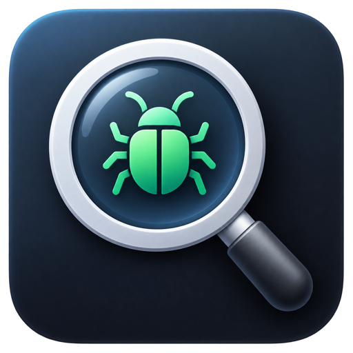
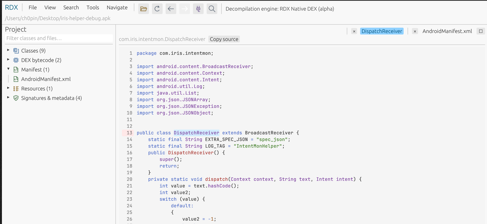
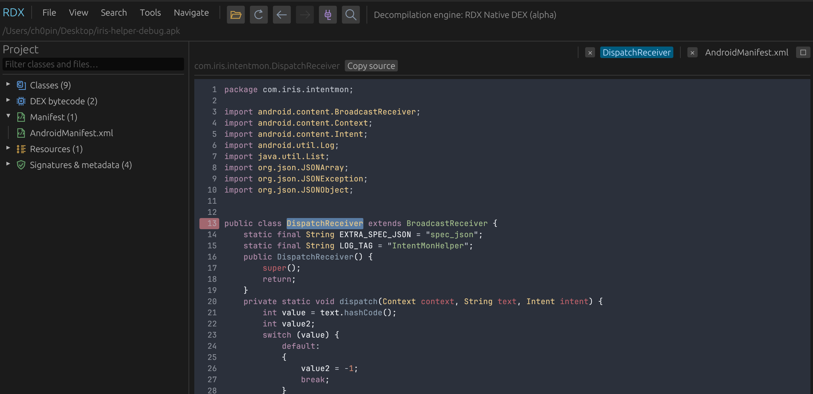
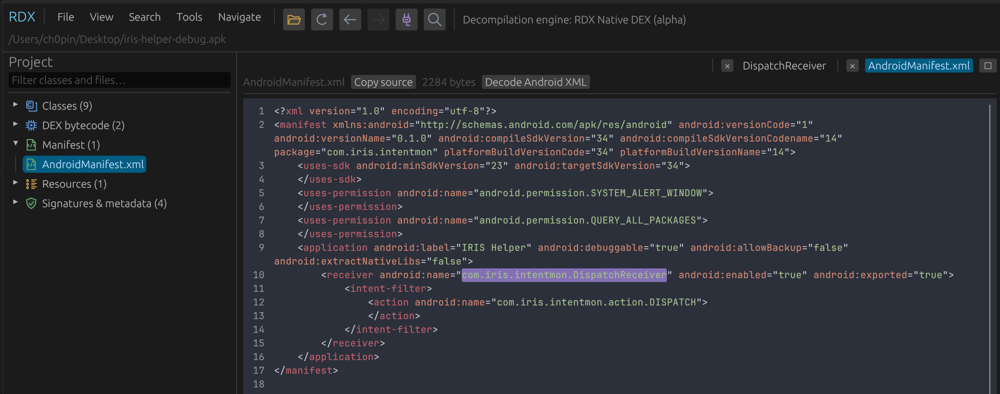

<p align="center">
  
</p>

<h1 align="center">RDX</h1>
<p align="center"><strong>Explore Android apps. Follow the code. Understand what happens.</strong></p>
<p align="center">Native Rust APK/DEX decompiler · macOS, Windows & Linux · Built-in MCP server</p>

RDX is a desktop tool for Android reverse engineering and code review. Open an APK,
read reconstructed Java, follow method calls, and inspect its manifest and resources
in one place. Use the GUI yourself or connect an AI assistant through MCP.

## Why RDX?

- **Native, self-contained engine.** Java reconstruction runs in Rust. No JVM, Java installation, or separate decompiler service to configure.
- **Responsive search.** Background searches stream results as they arrive. A session index reuses cached source for repeat searches.
- **Memory-conscious design.** Bounded source caches and a disk-backed search index control retained source data, without keeping every decompiled class in RAM.
- **Built for investigation.** Move from a manifest component to its code, then follow declarations, usages, callers, and callees without leaving the viewer.
- **Ready for agents.** The built-in MCP server lets assistants inspect local projects, with separate instances for parallel work.

Search speed and total memory use depend on the APK, cache state, and enabled
services. See [performance measurements](docs/search-performance.md) for the tested workloads.

## What you can do

| Task | Features |
| --- | --- |
| Read and navigate code | Reconstructed Java, exact DEX disassembly, declaration jumps, Back/Forward, tabs and bookmarks |
| Trace relationships | Find usages, method callers/callees, direct subclasses and implementations |
| Find what matters | Search classes, code, methods, fields and resources; exclude packages from searches |
| Inspect the APK | Decoded manifest/XML, exported-component highlighting, resource names and values, image previews and file exports |
| Customize your workflow | Light/dark themes, bundled code fonts, occurrence highlighting, Frida snippet copying and CLI access |

**Status: alpha.** Java reconstruction is still expanding. Unsupported methods
remain visible as labelled DEX disassembly. See [engine coverage and limitations](docs/native-engine.md).

## Screenshots

Click an image to view it at full size.

| Light theme | Dark theme |
| --- | --- |
| [](docs/images/rdx-light.png) | [](docs/images/rdx-dark.png) |

**Manifest inspection with exported components highlighted**

[](docs/images/rdx-manifest.png)

## MCP: connect your assistant

Let an MCP-compatible assistant browse classes, read Java or DEX, inspect methods
and fields, find direct subclasses, and retrieve manifests, resources and strings.
The server runs locally and is included in RDX—no separate server installation.

1. Open an APK in RDX and select **Tools → MCP Server…**.
2. Click **Start server**, then **Copy MCP client configuration**.
3. Paste the configuration into your assistant's MCP settings and reconnect it.

Open multiple RDX instances to let agents work on different APKs in parallel.
Requests identify both the instance and project to keep their work separate.
See [MCP setup and available tools](docs/mcp.md).

## Get started

**[Download RDX](https://github.com/Ch0pin/rdx/releases)** for macOS, Windows or Linux.
Extract the archive and launch the app. No Java, Rust, Python or Android SDK is
needed for prebuilt releases. See [installation and runtime requirements](docs/install.md)
for platform dependencies and first-launch instructions.

To build from source, install [Rust](https://rustup.rs/), then run from the repository directory:

```sh
cargo run --release -- /path/to/app.apk
```

Or launch with `cargo run --release` and drag an APK/DEX into the window.
Platform build requirements, macOS app packaging and CLI commands are in the
[user guide](docs/user-guide.md).

## More

[User guide](docs/user-guide.md) · [MCP tools](docs/mcp.md) ·
[Validation](docs/validation.md) · [Plugins](docs/plugins.md)

RDX uses JADX algorithms as a reference. See [JADX attribution](third_party/jadx/README.md),
[Android notices](third_party/android/README.md), [font licenses](third_party/fonts/README.md)
and [theme licenses](third_party/themes/README.md).
